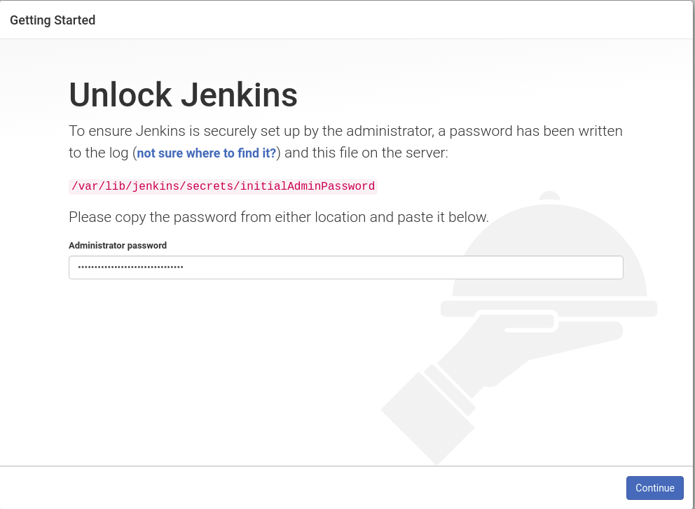

# Install Jenkins on CentOS 8
## Prerequisite
Java 8 or Java 11
## Installation
### Add Jenkins Software Repository
Run: <br>
`sudo wget -O /etc/yum.repos.d/jenkins.repo http://pkg.jenkins-ci.org/redhat-stable/jenkins.repo` <br>
If not download correctly, we need to add manually: <br>
1. Create and open repo file: `sudo nano /etc/yum.repos.d/jenkins.repo` <br>
2. Enter the following lines and save:
```
[jenkins]
name=Jenkins-stable
baseurl=http://pkg.jenkins.io/redhat
gpgcheck=1
```
3. Import the GPG key to ensure your software is legitimate <br>
`sudo rpm --import https://pkg.jenkins.io/redhat/jenkins.io.key`
### Install Jenkins package
Run: `sudo dnf install jenkins`
### Start Jenkins service
Enable: `sudo systemctl enable jenkins` <br>
Start: `sudo systemctl start jenkins` <br>
Restart: `sudo systemctl restart jenkins` <br>
### Change port
Change the port in file `/etc/sysconfig/jenkins` and restart service <br>
You might have to change port in `/usr/lib/systemd/system/jenkins.service`
### Run and Setup
1. Open the URL and you will see this on the browser: <br>

2. Follow the instructions of Jenkins
