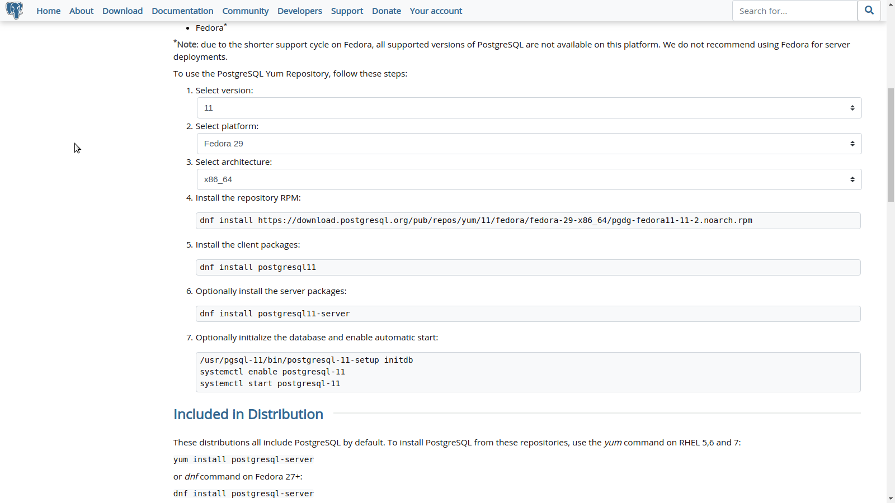

## Install PostgreSQL on Linux (Fedora)
1. Go to Dowload PostgreSQL site, choose your OS and then follow steps on below image.

2. After installing and starting the PostgreSQL services, run: `sudo su - postgres`, enter sudo password.
3. If you has not set PATH yet, run `export PATH="path_to_bin:$PATH"`. E.g `export PATH="/usr/pgsql-11/bin:$PATH"`.
4. Run `psql` to run psql interface. Now, we can use sql queries with postgresql
### Create user
1. `CREATE USER username WITH ENCRYPTED PASSWORD 'passoword';`
2. `ALTER USER username WITH ROLE1 ROLE2....;`
### Connect to PostgreSQL
1. Open `/var/lib/pgsql/11/data/pg_hba.conf` and configure follow the intructions. If you don't understand anything, only change METHOD (local, ipv4, ipv6 connection) to md5. Keep in mind the ADDRESS connection
2. Open `/var/lib/pgsql/11/data/postgresql.conf`, uncomment line `listen_addresses = 'localhost'` and `port = 5432`
3. Restart service: `sudo systemctl restart postgresql-11`
4. Test connection `psql -h 127.0.0.1 -d database_name -U user` and enter password for `user`. (You need create a database)
### Allow remotely connection to PostgreSQL
1. Firstly, open port if closed by firewall
2. Change `listen_addresses = '*'` in `/var/lib/pgsql/11/data/postgresql.conf`. Add this config if not exists.
3. Change in `/var/lib/pgsql/11/data/pg_hba.conf`: `host all all [ip/32 or 0.0.0.0/0 to any ip] md5`
4. Restart service: `sudo systemctl restart postgresql-11`
